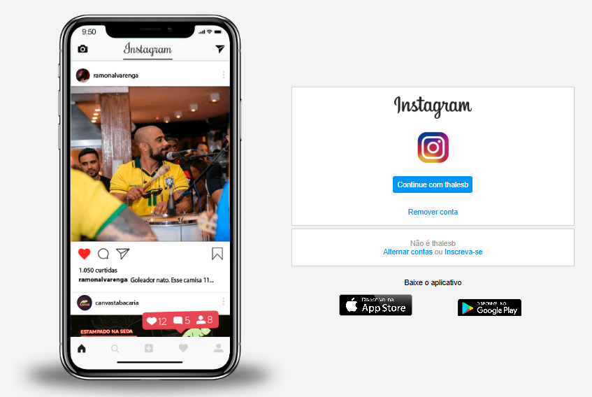

# Projeto: Clone da Tela Inicial do Instagram

Este projeto é um clone da **tela inicial do Instagram**, desenvolvido com o objetivo de praticar habilidades em **HTML**, **CSS** e **JavaScript**.

## Tecnologias utilizadas

- HTML5  
- CSS3 (Flexbox e Grid)  
- JavaScript (interações básicas)  
- Responsividade para dispositivos móveis

## Funcionalidades implementadas

- Interface semelhante à página de login do Instagram  
- Campos de login e senha  
- Link para recuperação de senha  
- Botões de login e acesso via Facebook  
- Design responsivo

## Captura de Tela

